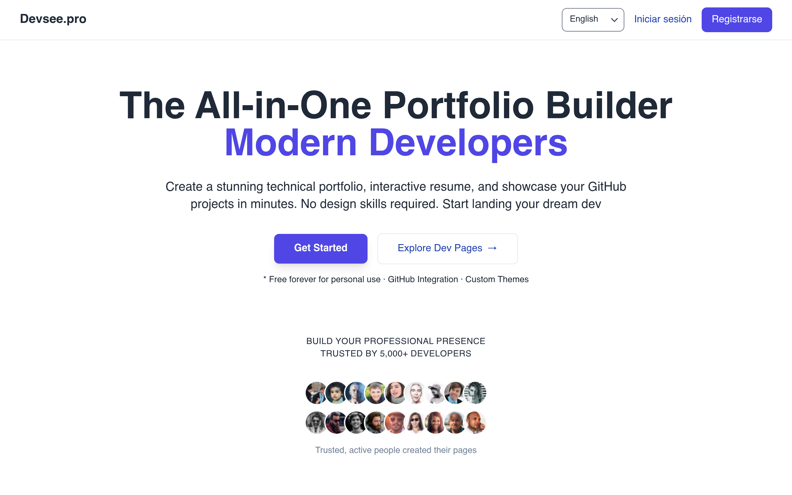
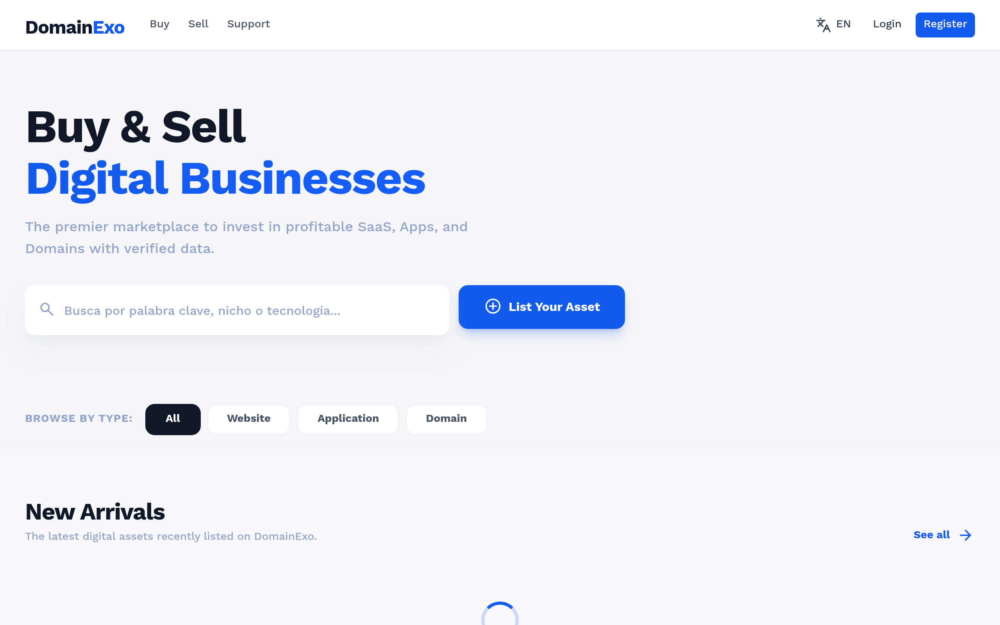
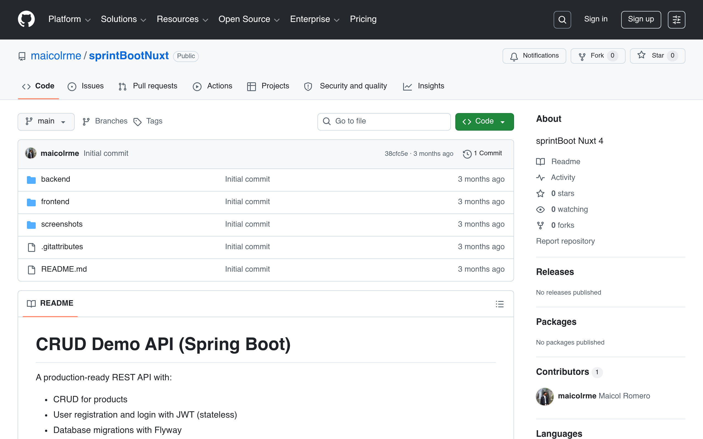
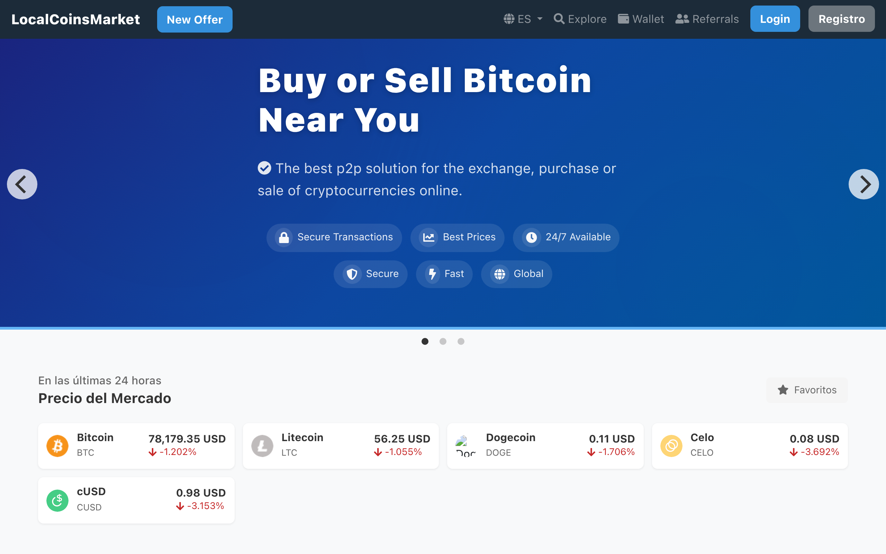

# 🚀 Full Stack Developer | SaaS, Fintech & Blockchain

## About Me
Full Stack Developer specialized in building **scalable SaaS platforms** and **custom backend systems** for startups and digital businesses. I help transform ideas into **secure, production-ready products** using modern backend and frontend technologies.

Strong experience in **fintech and blockchain**, working with Ethereum and Solana, wallet and token integrations, multi-wallet systems, gas relayers, webhooks, and automated workflows. I focus on clean architecture, scalability, and business-oriented solutions.

## Tech Stack

### Backend
- Laravel / Lumen
- Node.js / Express
- REST APIs
- API Authentication (API Keys, 2FA)

### Frontend
- Vue.js
- Nuxt
- Bootstrap
- Tailwind CSS

### Blockchain & Fintech
- Ethereum
- Solana
- ERC-20 Tokens
- Wallet & Multi-Wallet Systems
- Gas Relayers
- Webhooks & Automation

### Databases
- MySQL
- PostgreSQL
- MongoDB
- Redis

### DevOps & Cloud
- Linux Server Administration
- AWS (EC2, S3)
- Google Cloud
- DigitalOcean
- CI/CD & Git

## Interests
- SaaS & Startup Products
- Fintech & Blockchain
- API Development
- Service Automation
- Long-term Collaborations & Freelance Work

## Projects

- **[LostFinderr](https://lostfinderr.com)**  
  Platform focused on asset recovery and lost item tracking.  
  

- **[DevSee](https://devsee.pro)**  
  Talent recruitment and management solution for scaling teams.  
  

- **[FreeForDevs](https://freefordevs.com)**  
  A comprehensive collection of free resources, tools, and services for developers.  
  

- **[DomainExo](https://domainexo.com)**  
  Domain management and digital asset marketplace platform.  
  

- **[NettChain](https://nettchain.com)**  
  Blockchain infrastructure and network integration solutions.  
  

- **[NettChain PHP SDK](https://github.com/nettchain/phpsdk)**  
  PHP SDK for integrating with the NettChain blockchain API. Supports wallet operations, transactions, and smart contract interactions.  
  

- **[Spring Boot + Nuxt 4 CRUD](https://github.com/maicolrme/sprintBootNuxt)**  
  Full-stack application featuring a Spring Boot 3.2 backend and Nuxt 4 frontend. Includes JWT authentication (stateless), Role-Based Access Control (RBAC), database migrations with Flyway, and API documentation via Swagger/OpenAPI.  
  

- **[Team4Labs](https://team4labs.com)**  
  Platform built with Nuxt 4, Laravel backend, DigitalOcean cloud, Redis, and PostgreSQL.  
  

- **[Exchanger21](http://exchanger21.devsee.pro)**  
  Cryptocurrency exchange platform built with AdonisJS backend, Nuxt 4, DigitalOcean, Redis, MySQL, Docker. Features matching engine, P2P marketplace, and real-time events.  
  

- **[P2P Market](http://p2pmarket.devsee.pro)**  
  Local P2P marketplace with Laravel backend, microservices for cryptocurrencies (Bitcoin, Ethereum, Litecoin), MySQL, Redis, MongoDB, Docker, and real-time event handling.  
  

- **[DateOnline](https://date-online.app)**  
  Dating/meeting application demo built with Laravel 11, Tailwind CSS, Alpine.js, and MySQL.  
  

